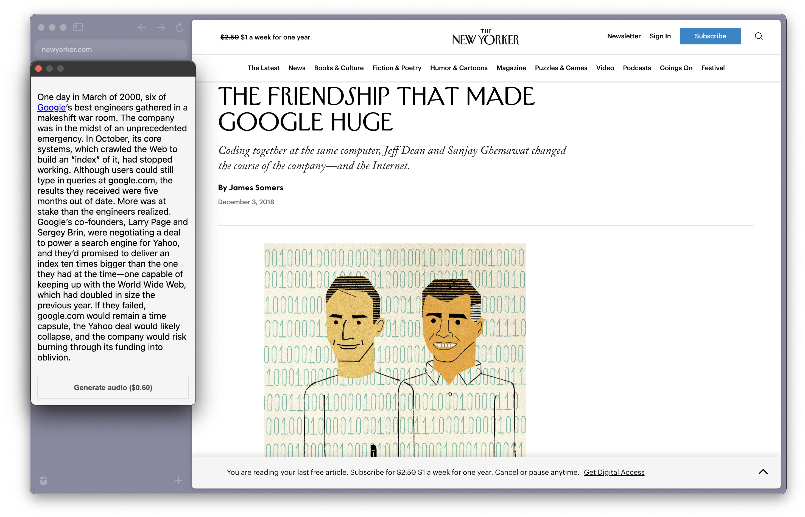
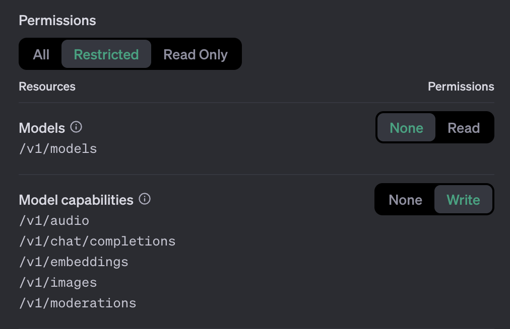

# generate-audio-extension



`generate-audio-extension` is a quick Chrome extension that allows you to generate audio of articles, using OpenAI's [TTS API](https://help.openai.com/en/articles/8555505-tts-api).

After generation, they're downloaded to your computer for offline reading.

## Getting started

> There is no official build of this extension. It requires work to setup and your own OpenAI key.

### Adding your key

You'll need to **provision a new API key** for `generate-audio-extension` here: https://platform.openai.com/api-keys

You should set the minimum permissions on your keys, like so:



Lastly, create an `api_keys.ts` file in the root of this repository, with the following:

```typescript
export const OPENAI_API_KEY = "put key here";
```

### Building the extension

[Bun](https://bun.sh/) is required to build this extension.

```
bun install
bun run build
```

### Loading the extension

There's currently no way of building a `.crx`—I am loading this as an unpacked extension.

- Go to `chrome://extensions`
- Make sure "Developer Mode" is switched on in the top-right corner.
- Click "Load unpacked" and direct it to the **`public/` folder** of this repository, **not the root.**

If you're successful, a pair of headphones should be in the toolbar upon visiting webpages!

## Technical details

We extract the text using a forked version of [@mozilla/readability](https://github.com/mozilla/readability).

Namely, it's patched to include *more* text, which makes it work better with The New Yorker articles.
